**CAHIER DE BORD** 

**09/09/2022 :** 

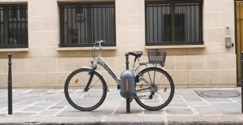

Phase de recherche sur le système : 

- Le boîtier se place sur un potelet et mesure 50 cm de haut avec un diamètre de 20 cm. 
- Le «U» à une largeur de 8,5 cm, une hauteur de 12 cm et un diamètre de 1,8 cm. De plus, il est fait en acier allié Nylon Plastique et pèse 2,27 kg. 
- Le système est équipé de capteurs pour prévenir les forces de l’ordre en cas de vol. 
- Le système est sécurisé via un dispositif de clefs électroniques cryptées et se déverrouille par Bluetooth. 

*Prochaine séance : Obtenir plus d’informations en contactant l’entreprise et commencer à modéliser la chaîne de puissance et d’information du système.* 

**13/09/22 :** 

Prise de contact avec l’entreprise et mise en relation avec le créateur du système. Suite à cela, j’ai pu en apprendre un peu plus sur le système. Ce système consiste en un simple mécanisme de U classique, piloté par un moteur électrique et la batterie dure environ 3-4 mois et est changé par des opérateurs en charge de la maintenance. A partir de cela, j’ai pu commencer à réaliser la chaîne de puissance et d’information du système. 

*Prochaine séance : Finaliser la chaîne de puissance et d’information du système et commencer les recherches sur la programmation Bluetooth à l’aide de modules Arduino.* 

**23/09/22 :** 

Finalisation de la chaîne de puissance et d’information du système : 

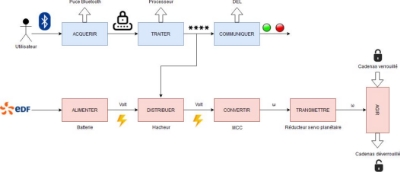

De plus, j’ai commencé des recherches sur la programmation Bluetooth sur le logiciel Arduino pour pouvoir entamer un programme capable d’allumer une DEL et par la même occasion, être capable de faire tourner le moteur. 

*Prochaine séance : Finaliser le programme et commencer la Mise en Cohérence des Objectifs du TIPE.* 

**27/09/22 :** 

Finalisation du programme permettant d’allumer une DEL (et/ou un moteur) par Bluetooth sur le logiciel Arduino. 

// définition de la broche i de la carte en tant que variable (valeur de la broche à définir) const int led\_rouge = i; 

String message; 

// fonction d'initialisation de la carte 

void setup() 

{ 

pinMode(led\_rouge, OUTPUT); // initialisation de la broche i comme étant une sortie Serial.begin(9600); // initialisation de la liaison série 

} 

void loop() 

{ 

if (Serial.available() > 0 )  //Si un message a été reçu  faire ceci 

{ 

message=Serial.readString(); // lire le message 

if(message=="1"){ 

digitalWrite(led\_rouge, HIGH);  // allume la LED (et le moteur) 

} 

if(message=="0"){ 

digitalWrite(led\_rouge, LOW); // éteint la LED (et le moteur) 

} 

} 

} 

Commencement et finalisation de la Mise en Cohérence des Objectifs du TIPE. 

*Prochaine séance : Modéliser le «U» sur Solidworks et faire les simulations nécessaires pour connaître la valeur maximale que peut supporter le «U».* 

**07/10/22 :** 

Modélisation du «U» sur le logiciel Solidworks pour pouvoir déterminer les efforts maximum qu’il peut supporter avant de céder. 

Échec lors de la simulation Solidworks. 

*Prochaine séance : Refaire une simulation pour connaître cette valeur et commencer des recherches sur les forces exercées par une pince.* 

**11/10/22 :** 

Simulation réussi pour une pression de 9N/m² 

 

Commencement des recherches pour connaître la valeur exacte de la pression exercée par une pince (pour remplacer le 9N/m² théorique) : 

(E1) Force tangentielle équivalente : √[ (  2 +  2) + +~~   ]² +  ² 

T 

(E2) Force perpendiculaire équivalente : Fy az+2 + Fz ay

T  T

(E3) Force de serrage théorique : Supérieure à E1/2µ et (E2) (E4) Force de serrage : (E3) x 1,5 (coefficient de sécurité) 

Avec : 

Fx : La force suivant l’axe de la pince 

az : La distance suivant Z du centre de gravité au centre de pression T : La largeur du doigt de serrage 

ay : La distance suivant Y du centre de gravité au centre de pression d : Le diamètre de serrage de la pince 

Fz : La force tangentielle au doigt 

Fy : La force perpendiculaire au doigt 

ax : La distance suivant X du centre de gravité au centre de pression µ : Coefficient de frottement mors/pièce 

Contrainte :  ⃗( , ⃗) =  ⃗   = ∬  .  =  .  ,  ∶   = Remarque : une contrainte  < 0 en compression 

Avec : 

N[N], S[mm²],  [MPa], Rpc : contrainte pratique à la compression en [Mpa] 

Idée d’expérience : Pour trouver la valeur de la force exercée par la pince sur le «U», on pourrait soit la déterminer avec un dynamomètre, soit avec des jauges de déformations. 

*Prochaine séance : Déterminer les différentes forces appliquées par une pince à l’aide des formules puis, les implémenter dans Solidworks pour avoir de meilleurs valeurs.* 

**21/10/22 :** 

Création et simulation d’un montage ainsi que d’un programme permettant d’allumer ou d’éteindre la LED sur le logiciel Tinkercard. 

*Prochaine séance : Tout fonctionne sur le logiciel, il ne reste plus qu’à réaliser ce montage et le tester en réalité.* 

**08/11/22 :** 

Réalisation du montage et simulation réelle de ce dernier : 

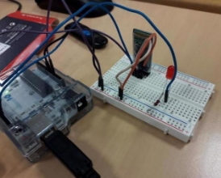

Lorsque l’on envoie ‘’0’’ au module, (grâce à un interrupteur programmé sur l’application Arduino Bluetooth Controller) la LED s’éteint 

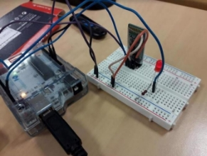

Lorsque l’on envoie ‘’1’’ au module, (grâce à un interrupteur programmé sur l’application Arduino  Bluetooth  Controller)  la  LED s’allume 

*Prochaine séance : Réaliser un programme permettant de faire fonctionner à la fois le moteur et la LED.* 

**18/11/22 :** 

Création  du  programme  permettant  de  faire  tourner  le  moteur. Lors  de  la  simulation  de ce programme, aucunes erreurs n’a été trouvée, cependant, lorsque j’ai transféré le programme dans la carte Arduino, je n’avais rien en sortie du montage. 

` `

*Prochaine séance : Trouver l’anomalie du programme ou/et du montage pour pouvoir la régler et ainsi pouvoir faire fonctionner mon système.* 

**22/11/22 :** 

Après avoir modélisé le nouveau montage sur le logiciel Tinkercard, je me suis rendu compte que le problème ne venait pas de ce dernier mais du programme mais après l’avoir simulé à son tour, aucunes erreurs n’a été trouvés. 

*Prochaine séance : Comprendre pourquoi il n’y a aucune tension en sortie du montage, régler ce problème et réussir à alimenter le moteur.* 

**02/12/22 :** 

Après avoir enfin réussi à trouver l’erreur (oublie de définir une sortie sur la carte Arduino ainsi, le hacheur ne permettait pas d’alimenter le moteur) j’ai réaliser un montage avec le moteur uniquement et est réussi à le faire tourner. 

*Prochaine séance : Relier le moteur au reste du montage pour voir si le montage final fonctionne.* **06/12/22 :** 

Après avoir réaliser le montage final et envoyé un ‘’0’’ ou un ‘’1’’ à mon module Bluetooth, la LED s’est allumée mais le moteur ne tourné pas, ce qui m’a donc permis de comprendre que l’erreur ne venais pas du montage de la LED mais de celui lié au moteur. 

*Prochaine séance : Corriger l’ensemble des erreurs liées au moteur et faire fonctionner le montage final.* 

**16/12/22 :** 

Correction du code permettant de faire fonctionner le moteur en même temps que la LED 

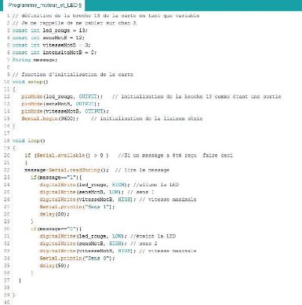

Montage : 

**16/12/22 :** 

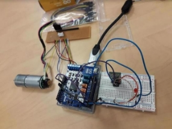

Lorsque l’on envoie ‘’0’’, la LED s’éteint et le moteur tourne dans le sens de fermeture de notre serrure. 

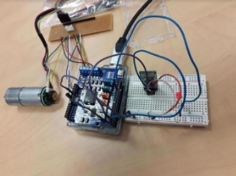

Lorsque l’on envoie ‘’1’’, la LED s’allume et le moteur  tourne  dans  le  sens  d’ouverture  de notre serrure. 

**16/12/22 :** 

*Prochaine séance : Maintenant que la modélisation de mon système à été menée à son terme, je vais pouvoir me consacrer sur l’aspect théorique de mon système.*

**13/01/23 :** 

Réalisation d’une expérimentation : après m’être filmé en train de mettre un coup de marteau sur un objet, j’ai importé la vidéo sur le logiciel Tracker afin de déterminer la force d’impact que pouvait avoir mon marteau. Une fois la vidéo importé et les points placés, j’ai demandé au logiciel de déterminer l’accélération moyenne du marteau lors d’un coup pour utiliser la formule suivante : 

Force = masse\*accélération 

Après calculs, le logiciel m’a donné un résultat plus que discutable qui ne semblait pas correspondre à la réalité. 

*Prochaine séance : Réaliser une nouvelle expérience a l’aide d’un dynamomètre afin de déterminer la force appliquée par le marteau.* 

**17/01/23 :** 

Après avoir réaliser une expérimentation à l’aide d’un dynamomètre et d’un marteau (le marteau était relié au dynamomètre à l’aide d’une corde et le dynamomètre était filmé au ralenti), j’ai pu déterminer l’effort de mon marteau qui était au maximum de 60N. 

Une fois ceci fait, je suis passé à la simulation sur Solidworks. 

A l’aide d’un outils présent sur le logiciel, j’ai pu appliqué un effort de 60N sur l’ensemble de ma structure (plus tard, il faudra concentré l’effort sur un petit élément de surface) et voici ce que j’ai obtenu. 

**31/01/23 : 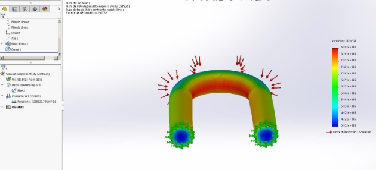**

Simulation de l’effort de 60N à l’aide d’un marteau. On remarque que lorsque l’effort est appliqué sur la partie intérieure de notre pièce, il y a de forte chance pour que cette dernière cède sous les coups du marteau alors que le reste de la pièce semble pouvoir résister à de tels efforts. Le U du cadenas étant en position fermé rend l’accès de cette partie quasiment inaccessible et réduit donc les chances de 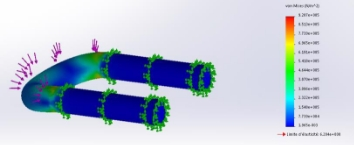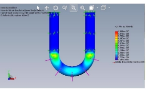

Ici, nous avons la simulation faite avec l’aide de l’outil simulation Xpress de Solidworks. Cette dernière exagère la déformation de la pièce de 10^9 afin de voir la déformation de la pièce causée par chaque impact. A l’aide de cette simulation, nous pouvons conclure que les zones les plus fragiles de la pièce sont les arrondis du U mais cette étude permet aussi de conclure sur le fait que la pièce est capable de résister à des coups de marteaux d’une telle ampleur et permet donc d’assurer la sécurité d’un vélo. 

*Prochaine séance : Maintenant que l’étude sur le marteau est terminée, je vais pouvoir passé à celle de la perceuse afin de voir si notre pièce est capable de résister à ce style de machine.*  

**31/01/23 :** 

Premièrement, j’ai déterminé la force exercée par une perceuse. Perceuse : 

Rayon = 0,0175 m 

Vitesse = 0,4166 m/s 

Vitesse de rotation : 23,81 rad/s 

P = FV 

F = P/V 

Puissance = 900 W 

F = 900 / 0,4166 

Donc F = 2160 N 

Une fois que j’ai déterminé cette force, j’ai pu la simuler sur Solidworks. 

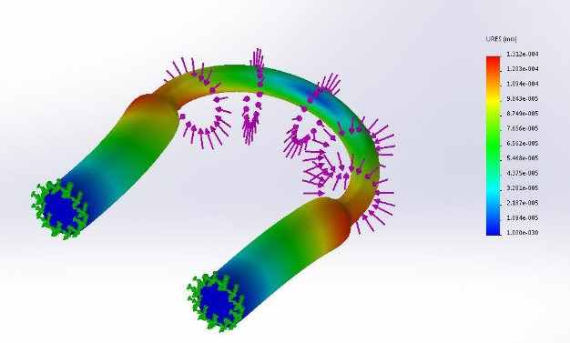

Simulation de l’effort de 2160N à l’aide d’une perceuse. On remarque que lorsque l’effort est appliqué sur la partie arrondi de notre pièce, il y a de forte chance pour que cette dernière cède sous les coups de la perceuse de plus, même la partie encastrée de la pièce semble céder sous de tels efforts.  

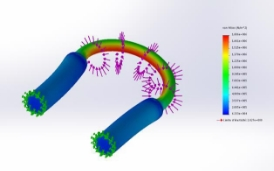

Ici, nous avons la simulation faite avec l’aide de l’outil simulation Xpress de Solidworks. Cette dernière exagère la déformation de la pièce de 10^9 afin de voir la déformation de la pièce causée par chaque coup de perceuse. A l’aide de cette simulation, nous pouvons conclure que la zone la plus fragile de la pièce lorsqu’elle est soumise à une perceuse est l’arrondi toute entier de cette dernière mais cette étude permet aussi de conclure sur le fait que la pièce n’est pas du tout capable de résister à des coups de perceuse d’une telle ampleur ce qui met la sécurité d’un vélo en danger si quelqu’un décide d’utiliser un tel outils pour s’emparer d’un vélo. De plus, nous pouvons rajouter que le temps que mettrait la pièce pour se casser serait vraiment minime. 

*Prochaine séance : Après avoir parlé avec Monsieur Asensi de ces expérimentations et simulations, nous sommes parvenus à la conclusion qu’il fallait recommencer ces études en représentant le choc d’un coup de marteau avec un ressort.*  

**14/02/23 :** 

Après m’être muni d’un petit ressort, j’ai pu commencé mes expérimentations : 

Module d’élasticité de Young de la pièce : E = 2,05\*10^11 N/m² Taille initiale du ressort  : l = 3 cm 

Taille finale du ressort : l = 0,55 cm

[Δl = 2,45 cm ](https://fr.wiktionary.org/wiki/%CE%94)

[Pour F = 5 N (trouvée à l'aide d'un dynamomètre) ](https://fr.wiktionary.org/wiki/%CE%94)

[On a : F = k*Δl ](https://fr.wiktionary.org/wiki/%CE%94)

[Ainsi, on détermine que le ressort à une constante k = 204,08 N/m ](https://fr.wiktionary.org/wiki/%CE%94)

[De plus, on sait que : ](https://fr.wiktionary.org/wiki/%CE%94)

[k = AE/L ](https://fr.wiktionary.org/wiki/%CE%94)

[F = (k/A)*Δl ](https://fr.wiktionary.org/wiki/%CE%94)

[A est la section transversale du matériau ](https://fr.wiktionary.org/wiki/%CE%94)

[On arrive donc à la conclusion que la force maximale du ressort est : ](https://fr.wiktionary.org/wiki/%CE%94)

[Fmax=sqrt(k*m)*V ](https://fr.wiktionary.org/wiki/%CE%94)

[Ainsi, il ne me manque plus qu'à déterminé la vitesse à laquelle va le marteau pour pouvoir déterminer sa force maximale en sachant qu'il a une masse de 4,49 kg et une constante de raideur k = 204,08 N/m. ](https://fr.wiktionary.org/wiki/%CE%94)

[*Prochaine séance : Déterminer à quelle vitesse va le marteau à l'aide d'un logiciel de traking et appliquer la formule afin de connaître la force maximale appliquée par le mateau pour enfin pouvoir la simuler sur Soliworks (sur un petit élément de surface) et conclure sur la capacité de résistance de la pièce à de tels efforts.*  ](https://fr.wiktionary.org/wiki/%CE%94)
